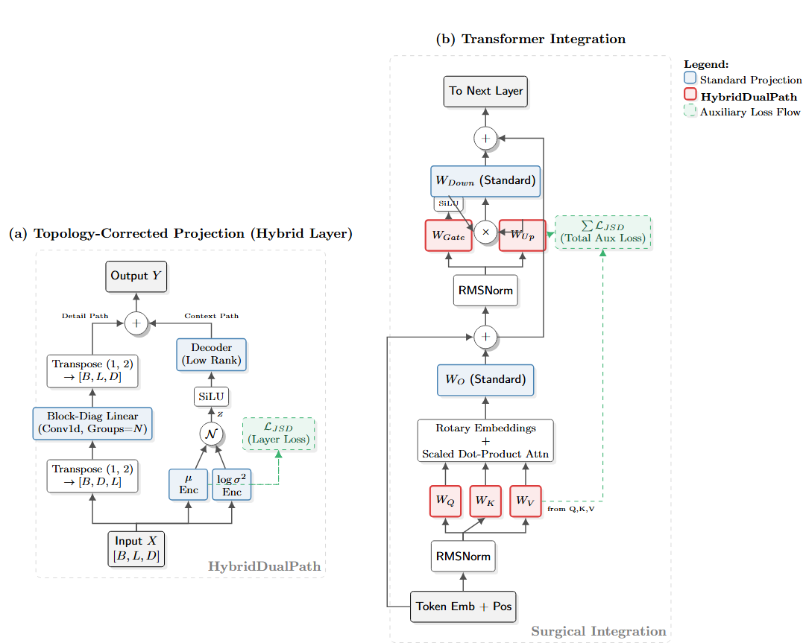

<div align="center">

# Hybrid Dual-Path Linear Transformations for Efficient Transformer Architectures


</div>

<p align="center">
  <strong>Implementation of the paper "Hybrid Dual-Path Linear Transformations for Efficient Transformer Architectures"</strong>
</p>


<!-- [](...) -->


<!-- [](https://doi.org/10.5281/zenodo.18271930) -->


## Abstract

Standard Transformer architectures rely heavily on dense linear transformations, treating
feature projection as a monolithic, full-rank operation. We argue that this formulation is
inefficient and lacks the structural inductive bias necessary for distinguishing between local
feature preservation and global context integration. To address this, we introduce the Hybrid
Dual-Path Linear (HDPL) operator, which decomposes the affine transformation into
two topologically distinct pathways: a sparse block-diagonal component for high-rank local
processing, and a low-rank Variational Autoencoder (VAE) bottleneck for global context
regularization.
By “surgically” replacing specific projections (Query, Key, Value, Gate, Up) with HDPL
operators while retaining standard dense layers for aggregation (Output, Down), we achieve a
superior balance of efficiency and representational power. Experiments on the FineWeb-Edu
dataset demonstrate that the HDPL architecture outperforms a standard Llama-style baseline,
reducing validation loss while simultaneously reducing parameter count by ≈ 6.8%. Beyond
immediate performance gains, we discuss how the explicit materialization of a probabilistic
latent space within the Transformer backbone serves as a vital architectural affordance, offer-
ing new pathways for inference-time or hypernetwork induced control, continual adaptation,
interpretability, and cross-model or cross-modal synchronization.

---

## Model Architecture



## Install and run

```bash
# In Kaggle Notebook

# %%writefile training_script.py if .ipynb format or directly upload given .py file

# # DO FACTORY RESET
# !pip uninstall -y pyarrow datasets
!pip install -qU datasets transformers sympy pandas matplotlib pyarrow 
# !pip install -qU datasets pyarrow tiktoken sympy pandas matplotlib
!pip uninstall -y tensorflow
!pip install -q tensorflow-cpu
# # DO NORMAL RESTART

# Run 
!python training_script.py
```


<!-- ## Citation

If you utilize this code or the concepts presented in **HDPL** for your research, please cite the following paper:


<!-- ```bibtex

``` -->
